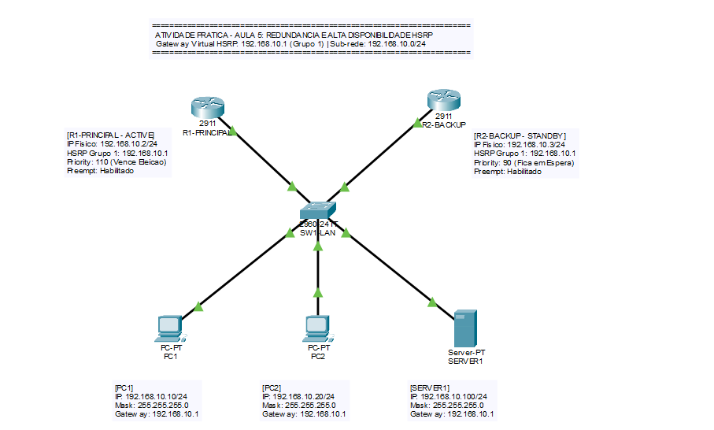
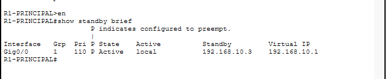
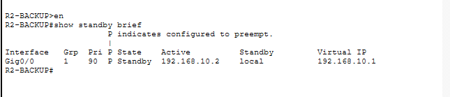
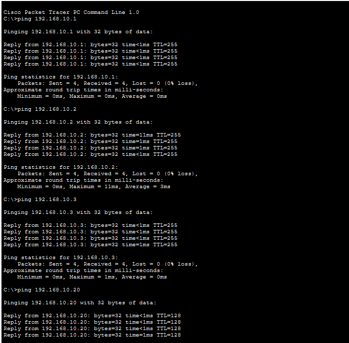
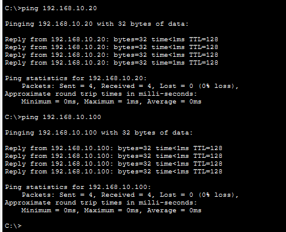
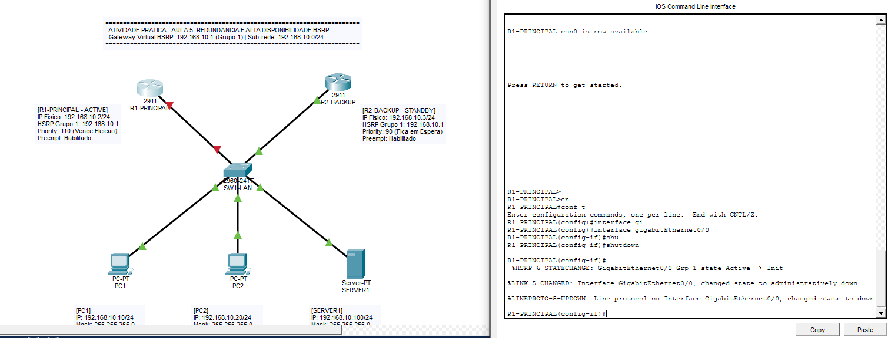
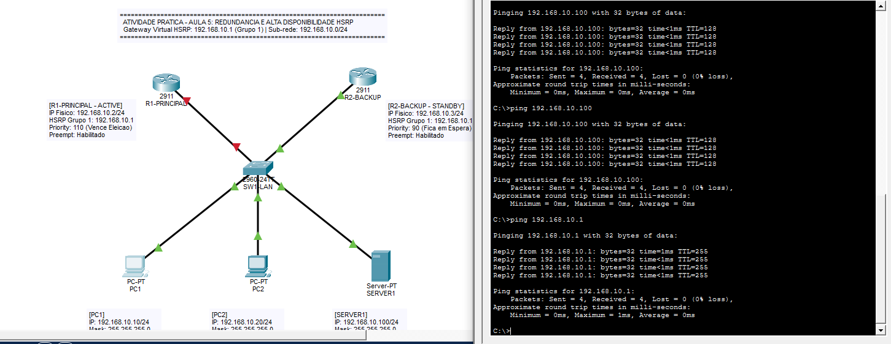

# Atividade Prática - Aula 5: Redundância de Gateway e Alta Disponibilidade com HSRP

**Disciplina:** Estudos Avançados em Ciências da Computação  
**Professor:** Paulo Sérgio Granato  
**Turma:** N13208A (Semestre 2026.2)  
**Grupo 03:** Matheus Sousa dos Santos (52319400), Felipe Guarnieri Pinete (52319337), Guilherme Gustavo Weber (52420339)  
**Data:** 2026-09-09  
**Arquivo do Packet Tracer:** `GRUPO_03_HSRP_ALTA_DISPONIBILIDADE.pkt`  

---

## 1. Tabela de Endereçamento IP

| Dispositivo | Interface | Endereço IP | Máscara | Gateway | Função HSRP |
| :--- | :--- | :--- | :--- | :--- | :--- |
| **R1-PRINCIPAL** | Gi0/0 | `192.168.10.2` | `255.255.255.0` | - | Active (Prioridade 110) |
| **R2-BACKUP** | Gi0/0 | `192.168.10.3` | `255.255.255.0` | - | Standby (Prioridade 90) |
| **Gateway Virtual** | Grupo 1 | `192.168.10.1` | `255.255.255.0` | - | IP Virtual |
| **PC1** | Fa0 | `192.168.10.10` | `255.255.255.0` | `192.168.10.1` | Host LAN |
| **PC2** | Fa0 | `192.168.10.20` | `255.255.255.0` | `192.168.10.1` | Host LAN |
| **SERVER1** | Fa0 | `192.168.10.100` | `255.255.255.0` | `192.168.10.1` | Servidor |

---

## 2. Comandos nos Roteadores

### R1-PRINCIPAL
```text
hostname R1-PRINCIPAL
interface GigabitEthernet0/0
 ip address 192.168.10.2 255.255.255.0
 no shutdown
 standby 1 ip 192.168.10.1
 standby 1 priority 110
 standby 1 preempt
```

### R2-BACKUP
```text
hostname R2-BACKUP
interface GigabitEthernet0/0
 ip address 192.168.10.3 255.255.255.0
 no shutdown
 standby 1 ip 192.168.10.1
 standby 1 priority 90
 standby 1 preempt
```

---

## 3. Questões Respondidas

**1. Qual problema existente em uma rede com apenas um gateway foi solucionado nesta atividade?**  
Eliminou-se o ponto único de falha. Se houver apenas um roteador e ele parar, os computadores perdem a comunicação externa. Com dois roteadores sob HSRP, o serviço continua ativo automaticamente.

**2. O que significa Alta Disponibilidade?**  
É a capacidade da rede de manter os serviços funcionando sem interrupção diante de falhas de hardware ou links físicos, reduzindo a indisponibilidade ao mínimo por meio de redundância e troca automática.

**3. O que é um FHRP?**  
First Hop Redundancy Protocol (Protocolo de Redundância de Primeiro Salto). Família de protocolos que oferece tolerância a falhas no gateway padrão dos computadores. Exemplos: HSRP, VRRP e GLBP.

**4. Qual foi a função do HSRP nesta topologia?**  
Juntar os dois roteadores físicos sob um único endereço IP virtual (192.168.10.1). O roteador principal assume o tráfego dos computadores e o segundo fica de prontidão caso ocorra pane.

**5. Qual a diferença entre o endereço 192.168.10.1, 192.168.10.2 e 192.168.10.3?**  
192.168.10.1 é o IP virtual do grupo HSRP usado como gateway pelos clientes. 192.168.10.2 é o IP físico da interface do R1. 192.168.10.3 é o IP físico da interface do R2.

**6. Por que os PCs utilizam 192.168.10.1 como gateway?**  
Porque o IP virtual não depende do equipamento físico individual. Se o roteador principal falhar, o reserva responde pelo mesmo IP virtual sem precisar reconfigurar as máquinas.

**7. Qual roteador iniciou como Active? Por quê?**  
R1-PRINCIPAL. Ele foi configurado com prioridade 110, maior que a prioridade 90 de R2-BACKUP. A prioridade numérica mais alta vence a eleição.

**8. Qual roteador iniciou como Standby?**  
R2-BACKUP, pois sua prioridade (90) é menor que a de R1 (110).

**9. O que aconteceu quando o R1 foi desligado?**  
R1 parou de enviar as mensagens de Hello. Após 10 segundos sem resposta, o temporizador de R2 expirou. R2 assumiu o papel de Active e passou a atender as requisições do IP virtual.

**10. Foi necessário alterar manualmente o gateway dos PCs após a falha? Explique.**  
Não. O gateway permaneceu 192.168.10.1 nos computadores. O switch apenas atualizou sua tabela CAM direcionando o MAC virtual para a porta de R2.

**11. Qual a função da prioridade no HSRP?**  
Definir qual roteador assume como ativo. A escala vai de 0 a 255 (o padrão é 100). Quem tiver o maior valor vence. Se houver empate, vence quem tiver o maior IP físico na interface.

**12. Qual a função do comando preempt?**  
Fazer com que o roteador de maior prioridade reassuma o papel de ativo assim que voltar a operar. Sem preempção, o roteador recuperado ficaria em Standby.

**13. O que aconteceria se R1 e R2 utilizassem números de grupos HSRP diferentes?**  
Eles formariam grupos independentes e não trocariam mensagens entre si. Geraria conflito de IP/ARP caso tentassem usar o mesmo IP virtual, ou funcionariam como dois gateways separados sem redundância.

**14. O que aconteceria se os computadores utilizassem 192.168.10.2 como gateway em vez de 192.168.10.1?**  
A rede perderia a alta disponibilidade. Se R1 caísse, os PCs ficariam sem saída para a rede e precisariam ser reconfigurados manualmente.

**15. Explique, com suas próprias palavras, o conceito de failover.**  
É o processo automático em que um sistema reserva assume as operações de um sistema principal que falhou, mantendo os serviços no ar sem que o usuário perceba.

---

## 4. Evidências dos Testes (Prints)

### Evidência 1 – Topologia Completa


### Evidência 2 – HSRP Funcionando Normalmente



### Evidência 3 – Testes de Comunicação (Ping)



### Evidência 4 – Falha no Roteador Principal


### Evidência 5 – Failover e Continuidade de Comunicação

