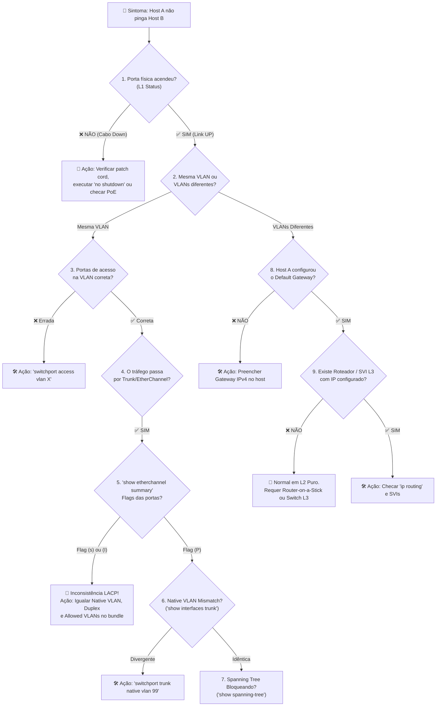

# 🧭 Árvore de Decisão: Troubleshooting de Redes (Camadas 1, 2 e 3)

> [!important] 🎯 Metodologia de Diagnóstico Rápido
> Quando um host reporta *"Sem Conexão"* ou o `ping` falha em um laboratório/prova, siga o fluxo de decisão abaixo para isolar o problema em menos de 1 minuto.

---

## 🗺️ Fluxograma de Diagnóstico (Decision Tree)



---

## 🔍 Guia Detalhado de Resolução por Cenário

> [!warning] 🚨 Cenário 1: Porta Suspensa no EtherChannel `Flag (s)`
> **Sintoma:** O comando `show etherchannel summary` mostra a porta com flag `(s)` (*Suspended*) ou `(I)` (*Individual*).
> **Causa Raiz:** Divergência de velocidade, duplex, modo de trunking, VLAN nativa ou lista de VLANs permitidas entre as portas membro do canal.
> **Como Resolver:**
> 1. Execute `show running-config interface <porta>` nos switches de ambos os lados;
> 2. Certifique-se de que a configuração é 100% idêntica:
> ```ios
> interface GigabitEthernet0/1
>  switchport trunk encapsulation dot1q
>  switchport mode trunk
>  switchport trunk native vlan 99
>  switchport trunk allowed vlan 10,20,30,40,99
>  channel-group 1 mode active
>  no shutdown
> ```
> 3. Se necessário, force a renegociação: `shutdown` seguido de `no shutdown`.

---

> [!danger] ⚡ Cenário 2: Erro de VLAN Nativa (*Native VLAN Mismatch*)
> **Sintoma:** Mensagens contínuas no console: `%CDP-4-NATIVE_VLAN_MISMATCH: Native VLAN mismatch discovered on GigabitEthernet0/1 (99), with SW-ACCESS-1 GigabitEthernet0/1 (1)`.
> **Causa Raiz:** Um lado do tronco está com `switchport trunk native vlan 99` e o outro lado permaneceu na VLAN nativa padrão `1`.
> **Impacto:** Tráfego não marcado de uma ponta vaza para a VLAN da outra ponta (vulnerabilidade grave).
> **Como Resolver:**
> ```ios
> ! No switch que estiver divergente:
> interface GigabitEthernet0/1
>  switchport trunk native vlan 99
> ```

---

> [!info] 📱 Cenário 3: Telefone IP Sem Áudio / Sem Registro na Voice VLAN
> **Sintoma:** O PC conectado atrás do telefone funciona, mas o IP Phone não obtém IP ou não registra no CallManager/CME.
> **Causa Raiz:** A porta do switch não foi configurada com a instrução `switchport voice vlan`.
> **Como Resolver:**
> ```ios
> interface FastEthernet0/5
>  switchport mode access
>  switchport access vlan 10
>  switchport voice vlan 40
>  no shutdown
> ```

---

> [!note] 🛑 Cenário 4: Ping Falha entre Computadores de VLANs Diferentes
> **Sintoma:** `PC-ADM-01` (192.168.10.11) não pinga `PC-FIN-01` (192.168.20.11) com retorno de *Request timed out*.
> **Diagnóstico:** Em uma rede puramente de Camada 2 (como o laboratório da Aula 2), **esse comportamento é 100% esperado**. Switches L2 não roteiam entre sub-redes.
> **Para habilitar no futuro (Aula 3):**
> 1. No switch L3: `ip routing`
> 2. Criar SVIs com IP:
> ```ios
> interface Vlan10
>  ip address 192.168.10.1 255.255.255.0
> interface Vlan20
>  ip address 192.168.20.1 255.255.255.0
> ```
