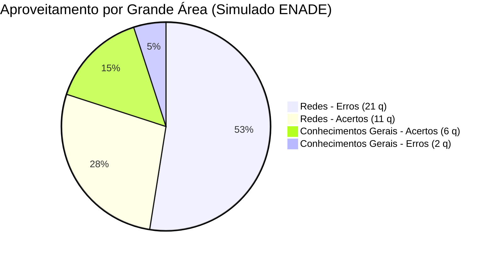

# Simulado Oficial ENADE 2026 — Diagnóstico Analítico, Mapeamento das 40 Questões e Plano de Estudos

> [!INFO] **Composição Oficial de Notas do Semestre (UniMAX 2026.2)**
> - **Avaliação Integrativa:** 2,0 pontos
> - **APEX (Atividades Práticas de Extensão / Simulado ENADE):** 1,0 ponto (conquistado independentemente da nota)
> - **Prova Regimental / Oficial:** 7,0 pontos
> - **Média Final:** $\text{Nota} = \text{Integrativa (2,0)} + \text{APEX (1,0)} + \text{Prova (7,0)} = 10,0$

## 1. Raio-X do Desempenho no Simulado

| Métrica | Valor Obtido | Status | Diagnóstico Crítico |
| :--- | :---: | :---: | :--- |
| **Pontuação Total** | **170 / 400** | 42,5% | Garantia de 1,0 pt no APEX, porém revela lacunas teóricas substanciais em Redes. |
| **Acertos Totais** | **17 questões** | 42,5% | Conhecimentos Gerais sustentaram a média; Redes teve índice alto de distração/chute. |
| **Erros Totais** | **23 questões** | 57,5% | Concentrados em Sub-redes/VLSM, OSPF multiarea, troubleshooting L1-L4 e cabeamento. |
| **Redes de Computadores (Q01-Q32)** | **11 / 32** | **34,4%** | **Gargalo Central**: Falhas em cálculo de prefixos, métricas OSPF e protocolos de enlace. |
| **Conhecimentos Gerais (Q33-Q40)** | **6 / 8** | **75,0%** | **Sólido**: Errou apenas na auditoria criptográfica de Urnas e na resolução TSE de Deepfakes. |

## 2. Mapa Sintético das 40 Questões

| # | Grande Domínio | Assunto / Tópico | Pontos | Status | Conceito Chave |
| :-: | :--- | :--- | :-: | :-: | :--- |
| Q01 | Redes | OSPF Multiarea e Tipos de Rota | 0/10 | ❌ ERRO | Rotas Inter-Area (O IA) via ABR e soma cumulativa de custos em links /30 |
| Q02 | Redes | Endereçamento IPv4 e VLSM/CIDR | 0/10 | ❌ ERRO | Sub-rede para 100 hosts exige máscara /25 (126 hosts válidos, bloco .0/25) |
| Q03 | Redes | Protocolo RIPv2 e Contagem de Saltos | 0/10 | ❌ ERRO | Métrica de saltos no RIPv2: anúncio em R2 chega ao R1 com métrica 2 |
| Q04 | Redes | Modelo OSI e Path MTU Discovery | 0/10 | ❌ ERRO | Camada de Aplicação/Transporte: SYN fecha, mas dados travam por MTU/Firewall |
| Q05 | Redes | Conectividade VPN e Portas de Serviço | 0/10 | ❌ ERRO | Camada de Transporte: Bloqueio de porta TCP 445 (SMB) no túnel VPN |
| Q06 | Redes | Roteamento e Redistribuição Estática | 0/10 | ❌ ERRO | Redistribuição de rota estática para 172.16.0.0/16 no processo OSPF do R1 |
| Q07 | Redes | Serviços de Rede: DHCP e Resolução DNS | 0/10 | ❌ ERRO | Escopo DHCP entregando DNS externo 8.8.8.8 impede resolução de nomes internos |
| Q08 | Redes | Roteamento Estático Matriz-Filial | 0/10 | ❌ ERRO | Configuração de rota estática no R2 apontando para próximo salto 10.0.0.1 |
| Q09 | Redes | Classificação Geográfica: LAN x WAN | 0/10 | ❌ ERRO | Redes internas Ethernet são LAN; enlaces de telecomunicação entre cidades são WAN |
| Q10 | Redes | Troubleshooting L4/L7: Portas e Firewall | 0/10 | ❌ ERRO | Ping ICMP responde, mas serviço web falha: portas TCP 80/443 fechadas no servidor |
| Q11 | Redes | Segurança de Redes: Análise de Tráfego | 0/10 | ❌ ERRO | Tráfego anômalo de host interno tentando conexões SSH externas não autorizadas |
| Q12 | Redes | Topologias de Rede: Estrela x Barramento | 0/10 | ❌ ERRO | Topologia em estrela oferece isolamento de falhas e expansão simplificada |
| Q13 | Redes | Cabeamento Estruturado: Limites de Distância | 0/10 | ❌ ERRO | Limite normativo de 100m para par trançado Cat6 (90m canal horizontal + 10m patch) |
| Q14 | Redes | Fibras Ópticas: Monomodo x Multimodo | 10/10 | ✅ ACERTO | Enlace de 80 km a 40 Gbps exige fibra Monomodo (SMF) com laser de 1310/1550nm |
| Q15 | Redes | Infraestrutura Física: PoE e Cabeamento | 0/10 | ❌ ERRO | Cabos Cat6 dedicados por dispositivo, terminados em Patch Panel e Switch PoE |
| Q16 | Redes | Projetos de Redes Sem Fio: Wi-Fi 6 | 0/10 | ❌ ERRO | Múltiplos APs distribuídos em células, planejamento de canais e PoE |
| Q17 | Redes | Cabos Industriais: Imunidade a Ruído (EMI) | 10/10 | ✅ ACERTO | Ambiente industrial com motores exige cabo blindado STP/FTP com aterramento |
| Q18 | Redes | Planejamento de Sub-redes Complexo (VLSM) | 0/10 | ❌ ERRO | Alocação contígua decrescente: 500 hosts (/23), 300 (/23), 200 (/24), 100 (/25), 50 (/26) |
| Q19 | Redes | Redundância de Internet e BGP Multihoming | 10/10 | ✅ ACERTO | Dois provedores distintos exigem BGP multihoming com roteador de borda |
| Q20 | Redes | Segmentação de VLANs e Modos de Porta | 0/10 | ❌ ERRO | VLANs restritas aos switches necessários, enlaces trunk 802.1Q e roteamento controlado |
| Q21 | Redes | Switches L3, SVIs e Filtros de ACL | 10/10 | ✅ ACERTO | Configuração de SVIs (interface Vlan) e ACLs aplicadas nas interfaces de roteamento |
| Q22 | Redes | VLANs: Portas de Acesso x Portas Trunk | 10/10 | ✅ ACERTO | Portas de computadores em modo access; portas entre switches em modo trunk 802.1Q |
| Q23 | Redes | DHCP Relay em Ambientes Multi-VLAN | 0/10 | ❌ ERRO | DHCP Relay nas SVIs/Gateways das VLANs 30/40 para converter broadcast em unicast |
| Q24 | Redes | Cálculo de Escopo DHCP e Hosts /23 | 0/10 | ❌ ERRO | Rede /23 possui 512 endereços (510 hosts utilizáveis), máscara 255.255.254.0 |
| Q25 | Redes | Tradução de Endereços: NAT / PAT | 10/10 | ✅ ACERTO | PAT (Port Address Translation) mapeia múltiplos IPs privados em um único IP público |
| Q26 | Redes | Diagnóstico de Tabela ARP e Conflito de IP | 0/10 | ❌ ERRO | Duplicidade de IP (192.168.10.50 no PC e na Impressora) gerando oscilação na tabela ARP |
| Q27 | Redes | Agregação de Links (LACP / EtherChannel) | 10/10 | ✅ ACERTO | LACP agrupa portas físicas em canal lógico, somando largura de banda e tolerância |
| Q28 | Redes | Atribuição de Blocos Contíguos | 10/10 | ✅ ACERTO | Divisão hierárquica contígua de sub-redes sem sobreposição para fácil sumarização |
| Q29 | Redes | Equipamentos: Hubs vs Switches | 10/10 | ✅ ACERTO | Switch divide domínios de colisão por porta e opera em Full-Duplex; Hub compartilha meio |
| Q30 | Redes | Simulação e Cabeamento no Packet Tracer | 10/10 | ✅ ACERTO | Identificação de tipos de cabos (direto x cruzado) e convergência de portas |
| Q31 | Redes | IoT e Desafios de Redes em Armazéns | 10/10 | ✅ ACERTO | Cobertura em armazéns metálicos exige antenas direcionais e mitigação de reflexão |
| Q32 | Redes/Negócios | Comércio Eletrônico e Globalização | 0/10 | ❌ ERRO | Concorrência global exige interoperabilidade de dados, segurança e adaptação logística |
| Q33 | Conhecimentos Gerais | Impacto Socioambiental e Mineração | 10/10 | ✅ ACERTO | Recuperação de áreas degradadas e participação comunitária em projetos minerários |
| Q34 | Conhecimentos Gerais | Segurança e Auditoria da Urna Eletrônica | 0/10 | ❌ ERRO | Confiabilidade assegurada por múltiplas camadas: criptografia, assinatura digital e TPS |
| Q35 | Conhecimentos Gerais | Princípios do Sistema Único de Saúde (SUS) | 10/10 | ✅ ACERTO | Princípios doutrinários: Universalidade, Equidade e Integralidade da assistência |
| Q36 | Conhecimentos Gerais | ESG, Ética e Governança de Dados | 10/10 | ✅ ACERTO | Responsabilidade corporativa no tratamento de dados e transparência algorítmica |
| Q37 | Conhecimentos Gerais | IA e Relações Humanas (Charge) | 10/10 | ✅ ACERTO | Crítica ao isolamento social e substituição acrítica de laços humanos por automação |
| Q38 | Conhecimentos Gerais | Legislação Eleitoral e Deepfakes | 0/10 | ❌ ERRO | Resolução do TSE: proibição expressa de deepfakes para beneficiar/prejudicar candidatos |
| Q39 | Conhecimentos Gerais | Bolhas Algorítmicas e Polarização (Tirinha) | 10/10 | ✅ ACERTO | Estratégias de pensamento crítico para romper viés de confirmação e bolhas digitais |
| Q40 | Conhecimentos Gerais | Uso Ético de Inteligência Artificial na Educação | 10/10 | ✅ ACERTO | IA como copiloto de apoio com conferência mandatória em fontes primárias confiáveis |

---

## 3. Análise Cirúrgica das 23 Questões com Erro (Onde Você Perdeu Pontos)

Esta seção disseca exatamente o que foi cobrado, qual era a pegadinha e qual é o fundamento teórico inegociável.

### Questão 01 — OSPF Multiarea — Tipos de Rota e Cálculo Cumulativo de Custo
> [!WARNING] **Status:** ❌ ERROU (0 / 10 pontos)
> **Cenário:** Topologia OSPF com Área 1, Área 0 (backbone) e Área 2 conectadas por R1, R2 e R3. Inclusão de uma nova Área 3 conectada ao backbone por R2, anunciando a rede 10.3.3.0/24.
> **Pergunta:** Qual será o tipo de rota e o custo esperado para a rede 10.3.3.0/24 na tabela de R1 após a convergência?

**Gabarito Correto:** A rota será instalada como **OSPF Inter-Area (O IA)**, com **custo 20**, pois R1 recebe de um ABR o anúncio de uma rede pertencente a outra área OSPF.

**Por que está correta:** No OSPF, quando um roteador aprende uma rede que está em outra área OSPF por meio de um ABR (Area Border Router), a rota recebe a classificação Inter-Area (código 'O IA'). O custo total é a soma cumulativa de saída das interfaces: Custo do link R1-R2 (10) + Custo do link R2-Área 3 (10) = 20.

**Onde esteve o erro:** Provavelmente confundiu com rota externa (O E1/E2, que só ocorre via ASBR/redistribuição externa) ou errou a soma aritmética do custo métrico do OSPF.

---

### Questão 02 — Endereçamento IPv4 e VLSM — Dimensionamento de Sub-redes
> [!WARNING] **Status:** ❌ ERROU (0 / 10 pontos)
> **Cenário:** Bloco 192.168.100.0/24 para distribuir entre LAN A (50 hosts), LAN B (100 hosts), LAN C (20 hosts) e 2 links ponto a ponto (2 hosts cada).
> **Pergunta:** Considerando o CIDR e futura sumarização, qual bloco deve ser atribuído à LAN B (100 hosts)?

**Gabarito Correto:** **192.168.100.0/25**, disponibilizando 126 endereços utilizáveis para os dispositivos da LAN B.

**Por que está correta:** Regra fundamental de VLSM: aloca-se do maior bloco para o menor. Para 100 hosts, precisamos de $2^h - 2 \ge 100$. Com $h=7$, $2^7 - 2 = 126$ hosts utilizáveis. A máscara é $32 - 7 = /25$ (255.255.255.128). O primeiro bloco contíguo é 192.168.100.0/25 (faixa de .1 a .126).

**Onde esteve o erro:** Optou por máscara inadequada (/26 só dá 62 hosts, insuficiente para 100) ou pegou faixa deslocada que fragmentaria a sumarização contígua.

---

### Questão 03 — Protocolo RIPv2 — Métrica por Contagem de Saltos (Hop Count)
> [!WARNING] **Status:** ❌ ERROU (0 / 10 pontos)
> **Cenário:** R1 conectado a R2 (Belo Horizonte), R3 (Curitiba) e R4 (Porto Alegre). A filial R2 passa a anunciar uma nova rede interna 10.2.1.0/24.
> **Pergunta:** Como essa nova rota será aprendida e instalada na tabela de roteamento de R1?

**Gabarito Correto:** A rede 10.2.1.0/24 será instalada como **rota RIP, via gateway 10.0.12.2 (R2), apresentando métrica 2** na tabela de R1.

**Por que está correta:** O RIP utiliza contagem de saltos como métrica única. Para R2, a rede 10.2.1.0/24 é diretamente conectada (métrica 0 internamente, anunciada com métrica 1). Ao passar pelo enlace ponto a ponto e ser recebida por R1, soma-se 1 salto, resultando em métrica 2 via próximo salto 10.0.12.2.

**Onde esteve o erro:** Muitos alunos confundem métrica de anúncio inicial com métrica instalada ou esquecem que no RIP o próximo salto é o IP da interface do roteador vizinho (R2).

---

### Questão 04 — Modelo OSI — Troubleshooting de Conexão TCP e MTU
> [!WARNING] **Status:** ❌ ERROU (0 / 10 pontos)
> **Cenário:** Usuário acessa https://sistema.connectcorp.com.br. A conexão TCP de 3 vias (SYN, SYN-ACK, ACK) é estabelecida com sucesso, mas a página web não carrega e dá timeout de payload.
> **Pergunta:** Com base no modelo OSI, em qual camada reside a causa provável?

**Gabarito Correto:** **Camada de Aplicação / Transporte (Problema de MTU e Fragmentação)**.

**Por que está correta:** Pacotes pequenos de handshake SYN (tamanho ~60 bytes) passam sem problema. Porém, ao iniciar a troca de dados TLS/HTTP (payload grande próximo a 1500 bytes), pacotes que excedem o MTU do túnel/firewall com flag DF (Don't Fragment) são descartados silenciosamente se o ICMP 'Fragmentation Needed' estiver bloqueado (Black Hole Router).

**Onde esteve o erro:** Pensou em camada de Rede ou Física porque 'não carregou', esquecendo que o handshake L4 funcionou perfeitamente, provando conectividade IP.

---

### Questão 05 — Acesso Remoto via VPN — Bloqueio de Portas de Transporte (SMB 445)
> [!WARNING] **Status:** ❌ ERROU (0 / 10 pontos)
> **Cenário:** Usuário fecha VPN com sucesso, acessa a intranet web corporativa normalmente, mas não consegue acessar o compartilhamento de arquivos (\\arquivos.datacorp.local).
> **Pergunta:** Em qual camada do modelo TCP/IP está a causa mais provável?

**Gabarito Correto:** **Camada de Transporte**, pois as tentativas TCP destinadas à **porta 445 (SMB)** apresentam retransmissões sem resposta (SYN retransmit), indicando bloqueio por ACL/Firewall.

**Por que está correta:** Se o portal web abre, a Camada de Internet (IP) e a resolução DNS estão operacionais. O protocolo de compartilhamento de arquivos do Windows (SMB/CIFS) roda estritamente sobre a porta TCP 445. O descarte exclusivo de pacotes SYN para a porta 445 comprova bloqueio na camada de transporte.

**Onde esteve o erro:** Atribuiu à camada de Aplicação ou erro de autenticação, ignorando o indício clássico de retransmissão de pacotes TCP.

---

### Questão 06 — Roteamento OSPF — Redistribuição de Rotas Estáticas
> [!WARNING] **Status:** ❌ ERROU (0 / 10 pontos)
> **Cenário:** A matriz possui uma rota estática para a rede 172.16.0.0/16. Os usuários da filial não conseguem alcançar esse destino porque R2 não tem essa rota.
> **Pergunta:** Qual é a ação mais adequada para que a filial alcance essa rede?

**Gabarito Correto:** **Redistribuir no R1 a rota estática para 172.16.0.0/16 dentro do processo OSPF**, permitindo que R2 e demais roteadores aprendam como rota externa (O E2).

**Por que está correta:** Rotas estáticas não são propagadas automaticamente por protocolos dinâmicos. É necessário o comando `redistribute static subnets` no roteador R1 para que ele atue como ASBR e propague o prefixo para todo o domínio OSPF.

**Onde esteve o erro:** Pensou em criar rotas estáticas manuais em todos os roteadores (inviável e não escalável) em vez de usar redistribuição dinâmica.

---

### Questão 07 — Serviços de Infraestrutura — Conflito de Servidor DNS no DHCP
> [!WARNING] **Status:** ❌ ERROU (0 / 10 pontos)
> **Cenário:** PC1 recebe IP via DHCP, navega na Internet perfeitamente (Google, portais), mas não resolve nomes corporativos da intranet (ex: intranet.unitech.local).
> **Pergunta:** Qual é a causa mais provável do problema relatado?

**Gabarito Correto:** O escopo **DHCP está atribuindo ao cliente um servidor DNS externo (ex: 8.8.8.8)**, impedindo a resolução de nomes da zona DNS interna corporativa.

**Por que está correta:** DNS públicos da Internet não possuem conhecimento de zonas privadas `.local` ou registros de Active Directory internos. O DHCP precisa entregar o IP do servidor DNS interno da empresa como primário.

**Onde esteve o erro:** Supôs falha de gateway ou roteamento, ignorando que o tráfego externo para a Internet estava funcionando 100%.

---

### Questão 08 — Roteamento Estático — Próximo Salto em Topologia Ponto a Ponto
> [!WARNING] **Status:** ❌ ERROU (0 / 10 pontos)
> **Cenário:** Interligação entre Matriz e Filial. R1 tem IP 10.0.0.1/30 e R2 tem IP 10.0.0.2/30. Deseja-se alcançar a rede 10.10.10.0/24 atrás de R1.
> **Pergunta:** Qual comando de rota estática deve ser configurado no roteador R2?

**Gabarito Correto:** Configurar no R2 a rota para **10.10.10.0/24 utilizando o endereço 10.0.0.1 (interface de R1) como próximo salto** (`ip route 10.10.10.0 255.255.255.0 10.0.0.1`).

**Por que está correta:** A rota estática em R2 deve especificar a rede destino, a máscara correspondente e o endereço IP da interface do roteador vizinho (próximo salto) que está conectado ao link.

**Onde esteve o erro:** Apontou para o IP da própria interface de R2 (10.0.0.2) ou inverteu a ordem dos parâmetros de destino e gateway.

---

### Questão 09 — Fundamentos de Redes — Classificação Geográfica (LAN vs WAN)
> [!WARNING] **Status:** ❌ ERROU (0 / 10 pontos)
> **Cenário:** Empresa com sede em São Paulo e duas filiais em cidades distintas, utilizando redes Ethernet internas e conexões de longa distância via operadora de telecomunicações.
> **Pergunta:** Como se classificam corretamente os segmentos da infraestrutura?

**Gabarito Correto:** As redes Ethernet internas das três unidades são **LAN**, enquanto os enlaces MPLS e VPN IPsec que interligam cidades distintas são **WAN**.

**Por que está correta:** LAN (Local Area Network) abrange edifícios ou ambientes geograficamente contíguos sob controle próprio. WAN (Wide Area Network) cobre distâncias intermunicipais/interestaduais dependendo de provedores públicos de telecom.

**Onde esteve o erro:** Confundiu MAN (Metropolitana) ou classificou tudo sob uma mesma categoria.

---

### Questão 10 — Troubleshooting de Conectividade — Ping Funciona mas Web Falha
> [!WARNING] **Status:** ❌ ERROU (0 / 10 pontos)
> **Cenário:** Clientes pingam o IP do servidor web com sucesso (tempo < 5ms, 0% perda), mas o navegador exibe mensagem de erro 'Conexão recusada' em http:// e https://.
> **Pergunta:** Qual é a causa mais provável para essa falha?

**Gabarito Correto:** Os serviços **HTTP e HTTPS não estão em execução ou as portas TCP 80 e 443 estão bloqueadas**, embora a conectividade IP básica (ICMP) esteja operacional.

**Por que está correta:** O protocolo ICMP (ping) opera na camada de rede (L3) e valida apenas o tráfego entre interfaces IP. Ele não atesta se o socket TCP na porta 80 ou 443 está escutando (`LISTENING`) na camada de aplicação.

**Onde esteve o erro:** Achou que o ping atesta o funcionamento de aplicações web.

---

### Questão 11 — Segurança de Redes — Detecção de Tráfego C2 (Command & Control)
> [!WARNING] **Status:** ❌ ERROU (0 / 10 pontos)
> **Cenário:** Registros de firewall indicam um computador interno da recepção tentando conexões recorrentes na porta TCP 22 (SSH) para um IP desconhecido na Europa Oriental.
> **Pergunta:** Qual é o risco de segurança primário associado a esse comportamento?

**Gabarito Correto:** Comunicação não autorizada de um **host interno comprometido (malware/botnet)** tentando canal de controle externo (C2/exfiltração de dados).

**Por que está correta:** Estações de trabalho corporativas convencionais não abrem sessões SSH ativas para servidores públicos no exterior. Esse padrão é clássico de reverse shell ou comunicação de trojan bancário/ransomware.

**Onde esteve o erro:** Pensou em ataque de força bruta contra o firewall externo, quando na verdade o tráfego era originado de dentro para fora.

---

### Questão 12 — Topologias Físicas e Lógicas — Escalabilidade da Topologia Estrela
> [!WARNING] **Status:** ❌ ERROU (0 / 10 pontos)
> **Cenário:** Empresa em expansão precisa escolher arquitetura de cabeamento para suportar novos departamentos sem que a queda de um ponto afete os demais.
> **Pergunta:** Qual topologia atende aos requisitos de escalabilidade e contenção de falhas?

**Gabarito Correto:** **Topologia em Estrela**, pois a desconexão ou rompimento de um cabo de usuário isola apenas aquele nó, mantendo o restante da rede operacional.

**Por que está correta:** Ao contrário do barramento ou do anel (onde o rompimento do meio interrompe todo o segmento), a estrela conecta cada nó a uma porta dedicada no switch central.

**Onde esteve o erro:** Pensou em malha completa (Mesh, inviável economicamente para estações finais) ou anel.

---

### Questão 13 — Cabeamento Estruturado — Limite Normativo do Cabo UTP Cat 6
> [!WARNING] **Status:** ❌ ERROU (0 / 10 pontos)
> **Cenário:** Distância de 90 metros em duto horizontal entre a sala técnica e um ponto de trabalho que requer velocidade Gigabit (1 Gbps).
> **Pergunta:** Qual tipo de cabo deve ser utilizado conforme a norma TIA/EIA-568?

**Gabarito Correto:** **Cabo UTP Categoria 6**, pois o canal de 90 metros está dentro do limite máximo de 100m e suporta 1 Gbps nativamente.

**Por que está correta:** A norma estipula o enlace permanente em até 90 metros de cabo rígido, reservando até 10 metros para patch cords nas extremidades (total de 100 metros). O Cat6 atende perfeitamente 1 Gbps nessa distância.

**Onde esteve o erro:** Sugeriu fibra óptica sem necessidade (custo desnecessário para menos de 100m) ou cabo Cat5 antigo.

---

### Questão 15 — Cabeamento Estruturado para CFTV e Telefonia com PoE
> [!WARNING] **Status:** ❌ ERROU (0 / 10 pontos)
> **Cenário:** Instalação de câmeras IP alimentadas por PoE e telefones IP em escritórios corporativos.
> **Pergunta:** Qual o procedimento de terminação correto conforme boas práticas?

**Gabarito Correto:** Instalar **cabos UTP Cat 6 individuais** para cada dispositivo, terminá-los no **patch panel** e conectar ao switch PoE por patch cords dedicados.

**Por que está correta:** É proibido compartilhar pares de um mesmo cabo de rede entre dois dispositivos diferentes (câmera e telefone), pois isso degrada a diafonia (crosstalk), viola o padrão IEEE 802.3af/at e inviabiliza Gigabit e PoE seguro.

**Onde esteve o erro:** Caiu na pegadinha da 'divisão de pares' para economizar cabo de rede.

---

### Questão 16 — Projetos de Redes Sem Fio — Planejamento Wi-Fi 6 (802.11ax)
> [!WARNING] **Status:** ❌ ERROU (0 / 10 pontos)
> **Cenário:** Ambiente corporativo com divisórias de alvenaria e vidro, demanda alta de dispositivos móveis e necessidade de roaming transparente.
> **Pergunta:** Qual é a melhor prática de implantação de pontos de acesso (APs)?

**Gabarito Correto:** Distribuir **múltiplos APs nas áreas de maior densidade**, alimentados via PoE, com potência calibrada para células menores e canais não sobrepostos.

**Por que está correta:** Potência alta em um único AP central é péssima prática: satura o canal, causa efeito 'farol' (dispositivo ouve o AP mas seu sinal fraco não chega de volta) e prejudica o roaming. O correto são células menores e densas.

**Onde esteve o erro:** Optou pela alternativa de 'colocar um único AP no centro com potência máxima'.

---

### Questão 18 — Dimensionamento de Sub-redes Hierárquicas (VLSM)
> [!WARNING] **Status:** ❌ ERROU (0 / 10 pontos)
> **Cenário:** Bloco privado 10.50.0.0/16 para alocar: Acadêmico (500 hosts), Visitantes (300 hosts), Administrativo (200 hosts), TI (100 hosts) e Segurança (50 hosts).
> **Pergunta:** Qual atribuição de sub-redes contíguas atende de forma otimizada?

**Gabarito Correto:** **VLAN 20 (Acadêmico): 10.50.0.0/23; VLAN 50 (Visitantes): 10.50.2.0/23; VLAN 10 (Admin): 10.50.4.0/24; VLAN 30 (TI): 10.50.5.0/25; VLAN 40 (Segurança): 10.50.5.128/26**.

**Por que está correta:** Ordenação estrita por tamanho de host:
1. 500 hosts $\to$ /23 (510 utilizáveis) $\to$ 10.50.0.0 a 10.50.1.255.
2. 300 hosts $\to$ /23 (510 utilizáveis) $\to$ 10.50.2.0 a 10.50.3.255.
3. 200 hosts $\to$ /24 (254 utilizáveis) $\to$ 10.50.4.0 a 10.50.4.255.
4. 100 hosts $\to$ /25 (126 utilizáveis) $\to$ 10.50.5.0 a 10.50.5.127.
5. 50 hosts $\to$ /26 (62 utilizáveis) $\to$ 10.50.5.128 a 10.50.5.191.

**Onde esteve o erro:** Erro clássico de VLSM: tentar calcular sem ordenar por tamanho decrescente ou sobrepor faixas de endereçamento.

---

### Questão 20 — Segmentação de VLANs e Arquitetura Core-Distribution-Access
> [!WARNING] **Status:** ❌ ERROU (0 / 10 pontos)
> **Cenário:** Instituição de ensino modernizando rede com 10 VLANs distintas (Alunos, Professores, Visitantes, Câmeras, Telefonia VoIP, Servidores).
> **Pergunta:** Como deve ser feita a distribuição de VLANs e portas nos switches?

**Gabarito Correto:** Configurar as **VLANs nos switches em que são necessárias, usar enlaces trunk 802.1Q entre Core e Acesso**, e aplicar roteamento Inter-VLAN com políticas restritivas.

**Por que está correta:** VLAN de visitantes deve ser isolada; VLAN de segurança não deve falar com alunos; portas de estações devem ser `switchport mode access` para evitar ataques de VLAN hopping.

**Onde esteve o erro:** Marcou opção que configurava todas as VLANs em modo trunk até as estações de trabalho de usuários.

---

### Questão 23 — Serviços em Redes Multi-VLAN — DHCP Relay (IP Helper-Address)
> [!WARNING] **Status:** ❌ ERROU (0 / 10 pontos)
> **Cenário:** Filial remota possui VLAN 30 e 40. O servidor DHCP corporativo reside na Matriz (192.168.100.10).
> **Pergunta:** Qual configuração deve ser aplicada para que os clientes da filial recebam IP?

**Gabarito Correto:** Configurar o **DHCP Relay (ip helper-address 192.168.100.10)** nas interfaces gateway das VLANs 30 e 40 do roteador R2.

**Por que está correta:** Mensagens de DHCP Discover são broadcast (255.255.255.255) e são descartadas pelo roteador. O DHCP Relay transforma o broadcast em um pacote unicast direcionado ao servidor da Matriz, injetando o campo `giaddr` (Gateway IP Address) para que o servidor saiba qual escopo entregar.

**Onde esteve o erro:** Achou que roteadores repassam broadcast por padrão através da WAN.

---

### Questão 24 — Cálculo de Capacidade de Hosts em Redes /23
> [!WARNING] **Status:** ❌ ERROU (0 / 10 pontos)
> **Cenário:** Rede corporativa 192.168.50.0/23 precisa de configuração de escopo no servidor DHCP.
> **Pergunta:** Qual é a máscara de sub-rede e a capacidade de endereçamento?

**Gabarito Correto:** Máscara **255.255.254.0**, disponibilizando **512 endereços totais (510 utilizáveis para hosts)**.

**Por que está correta:** Em /23, temos $32 - 23 = 9$ bits de host. $2^9 = 512$ endereços. Menos 2 (endereço de rede e broadcast) = 510 hosts utilizáveis. A máscara no terceiro octeto é $256 - 2 = 254$.

**Onde esteve o erro:** Confundiu com /22 (1022 hosts) ou /24 (254 hosts).

---

### Questão 26 — Troubleshooting ARP — Conflito de Endereço IP na LAN
> [!WARNING] **Status:** ❌ ERROU (0 / 10 pontos)
> **Cenário:** PC-03 e uma impressora de rede sofrem com perda intermitente de pacotes e travamento de conexão na rede local.
> **Pergunta:** Analisando a tabela de dispositivos, qual é a causa raiz da anomalia?

**Gabarito Correto:** **Conflito de IP entre o PC-03 e a impressora**, ambos configurados com o mesmo endereço IP **192.168.10.50**.

**Por que está correta:** Quando dois nós disputam o mesmo IP, o switch e os demais hosts recebem respostas ARP conflitantes ('ARP poisoning acidental'), atualizando a tabela ARP ora com o MAC do PC, ora com o MAC da impressora, causando oscilação violenta.

**Onde esteve o erro:** Atribuiu a problema de cabo ou duplex mismatch.

---

### Questão 32 — Comércio Eletrônico Global e Regulação Digital
> [!WARNING] **Status:** ❌ ERROU (0 / 10 pontos)
> **Cenário:** Pequena empresa brasileira enfrentando concorrência de plataformas internacionais e exigências regulatórias.
> **Pergunta:** Qual diretriz estratégica equilibra proteção e inovação?

**Gabarito Correto:** Combinar **políticas de defesa da concorrência, interoperabilidade e portabilidade de dados** com incentivos à inovação local.

**Por que está correta:** O protecionismo alfandegário puro isola o mercado e prejudica o consumidor. A regulação moderna foca em combater monopólios de dados e garantir interoperabilidade.

**Onde esteve o erro:** Optou por barreiras comerciais punitivas ou protecionismo tarifário extremo.

---

### Questão 34 — Sistemas Críticos — Confiabilidade e Auditoria da Urna Eletrônica
> [!WARNING] **Status:** ❌ ERROU (0 / 10 pontos)
> **Cenário:** Debate sobre segurança do processo eleitoral eletrônico brasileiro.
> **Pergunta:** Como a ciência da computação fundamenta a integridade do sistema eleitoral?

**Gabarito Correto:** Avaliar a confiabilidade por **múltiplas evidências independentes: controles criptográficos assimétricos, assinaturas digitais, integridade por resumo de hash e Testes Públicos de Segurança (TPS)**.

**Por que está correta:** A segurança da urna eletrônica não depende de 'fé institucional', mas de princípios matemáticos de computação: código lacrado digitalmente, verificação de integridade via SHA-512, assinatura digital com certificados ICP-Brasil e impressão física do Boletim de Urna (BU) para checagem pública descentralizada.

**Onde esteve o erro:** Marcou opção simplista focada em 'voto impresso obrigatório' ou desconsiderou os mecanismos criptográficos de auditoria.

---

### Questão 38 — Legislação Eleitoral e Regulação de IA (TSE)
> [!WARNING] **Status:** ❌ ERROU (0 / 10 pontos)
> **Cenário:** Propagação de vídeos e áudios sintéticos em campanhas eleitorais.
> **Pergunta:** Qual conduta viola expressamente as normas vigentes do TSE sobre Inteligência Artificial?

**Gabarito Correto:** O uso de **conteúdo manipulado digitalmente na forma de deepfake** para criar declarações falsas ou prejudicar/favorecer candidaturas.

**Por que está correta:** A Resolução 23.732/2024 do TSE baniu categoricamente o uso de deepfakes na propaganda eleitoral (sob pena de cassação de registro) e determinou a obrigatoriedade de rotulagem explícita em qualquer conteúdo gerado por IA.

**Onde esteve o erro:** Não conhecia a regulamentação recente do TSE para as eleições.

---

## 4. Auditoria das 17 Questões Acertadas (Validação de Conhecimento)

Você acertou 17 questões. Para garantir que o acerto não decorreu de mero chute, revise os fundamentos consolidados:

- **Q14 — Fibras Ópticas Monomodo:** Enlace de 80 km exige Monomodo (núcleo fino de 9 µm com laser). Fibras multimodo atenuam rapidamente por dispersão modal e só alcançam 550 metros.
- **Q17 — Cabos Blindados em Indústria:** Motores industriais geram ruído por indução eletromagnética (EMI). A proteção exige cabos STP/FTP com malha de blindagem aterrada.
- **Q19 — BGP e Redundância de Links:** Conexão a dois provedores de Internet distintos (multihoming) exige Autonomous System (AS) e roteamento via protocolo BGP para redundância dinâmica.
- **Q21 — Switches L3 e SVIs:** Switch de camada 3 roteia pacotes entre VLANs por meio de Interfaces Virtuais de Switch (SVIs) e aplica ACLs diretamente nos gateways.
- **Q22 — Portas de Acesso vs Trunk:** Portas para hosts finais operam em `mode access` (sem tag 802.1Q). Portas de interconexão entre switches operam em `mode trunk` transportando tags.
- **Q25 — NAT e PAT (Overload):** PAT utiliza portas TCP/UDP efêmeras para permitir que centenas de hosts privados naveguem na Internet compartilhando um único IP público.
- **Q27 — Agregação de Links (LACP):** O protocolo IEEE 802.3ad (LACP) agrega múltiplas portas físicas em um único canal lógico (EtherChannel), somando banda e evitando bloqueio pelo STP.
- **Q28 — Divisão Contígua de Sub-redes:** Distribuir sub-redes contíguas respeitando hierarquia de blocos permite que roteadores upstream sumarizem as rotas em uma única linha de tabela.
- **Q29 — Substituição de Hub por Switch:** Switches criam microsegmentação: cada porta é um domínio de colisão dedicado operando em Full-Duplex, eliminando o algoritmo CSMA/CD do Hub.
- **Q30 — Diagnóstico no Packet Tracer:** Compreensão da pinagem de cabos (cabos diretos para dispositivos diferentes, cabos cruzados para iguais) e verificação do status das portas.
- **Q31 — IoT e Armazéns Logísticos:** Armazéns com estruturas metálicas sofrem com gaiola de Faraday e multi-caminhos (multipath fading), exigindo posicionamento estratégico de antenas.
- **Q33 — Impacto Socioambiental da Mineração:** Conceito ENADE de sustentabilidade: exploração mineral deve ser acompanhada de planos de recuperação de áreas degradadas (PRAD) e royalties locais.
- **Q35 — Princípios Doutrinários do SUS:** Universalidade (acesso para todos), Integralidade (cuidado completo da prevenção à alta complexidade) e Equidade (tratar desiguais conforme suas necessidades).
- **Q36 — ESG e Ética de Dados:** Governança corporativa responsável exige conformidade com LGPD, minimização de dados coletados e transparência sobre o uso de algoritmos preditivos.
- **Q37 — Charge sobre Tecnologia e Isolamento:** Interpretação crítica do impacto da hiperconexão digital gerando isolamento social e deterioração de interações presenciais espontâneas.
- **Q39 — Tirinha: Bolhas Algorítmicas:** Algoritmos de engajamento em redes sociais promovem câmaras de eco e polarização; a superação exige busca deliberada por contraditório.
- **Q40 — Uso Ético de IA na Educação:** IAs generativas podem alucinar fatos e referências; o estudante deve usar a ferramenta como copiloto, mas assumir responsabilidade crítica pela checagem em fontes primárias.

---

## 5. Trilha Tática de Estudos para o ENADE (Syllabus de Recuperação)

Para sair dos 42,5% e atingir **80%+ no ENADE real**, foque exatamente nestes 5 módulos prioritários:

### Módulo 1: O Domínio Absoluto do Cálculo de Sub-redes (VLSM e CIDR)
- **O que dominar:** Tabela de potências de 2 ($2^1=2$ até $2^{16}=65536$).
- **Fórmula de Hosts:** $\text{Hosts Utilizáveis} = 2^{(32 - \text{prefixo})} - 2$.
- **Macete de Máscara:** $\text{Último octeto} = 256 - 2^{\text{bits de host no octeto}}$.
- **Exemplos Obrigatórios:**
  - `/23` = 512 IPs totais (510 hosts) $\to$ Máscara: `255.255.254.0`.
  - `/24` = 256 IPs totais (254 hosts) $\to$ Máscara: `255.255.255.0`.
  - `/25` = 128 IPs totais (126 hosts) $\to$ Máscara: `255.255.255.128`.
  - `/26` = 64 IPs totais (62 hosts) $\to$ Máscara: `255.255.255.192`.
  - `/30` = 4 IPs totais (2 hosts para links WAN) $\to$ Máscara: `255.255.255.252`.
- **Regra de Ouro:** Sempre ordenar os blocos da maior demanda para a menor para evitar fragmentação.

### Módulo 2: OSPF Avançado e Protocolos Dinâmicos
- **Áreas OSPF:** Área 0 (Backbone obrigatório). Todas as outras áreas devem se conectar à Área 0.
- **Papéis de Roteadores:**
  - **Internal Router:** Todas as interfaces na mesma área.
  - **ABR (Area Border Router):** Interfaces em duas ou mais áreas (conecta ao backbone). Gera rotas Inter-Area (`O IA`).
  - **ASBR (Autonomous System Boundary Router):** Conecta o domínio OSPF a fontes externas (rotas estáticas ou outros protocolos). Gera rotas Externas (`O E1` ou `O E2`).
- **Cálculo de Métrica:** $\text{Custo} = \frac{10^8}{\text{Largura de Banda em bps}}$ (soma cumulativa dos links de saída).

### Módulo 3: Troubleshooting de Redes L1 a L7
- **Problema: Ping funciona, mas Web não carrega?** $\implies$ O problema NÃO é de rede (L3). É porta fechada no firewall (L4) ou serviço web parado (L7).
- **Problema: Handshake TCP fecha, mas página dá timeout?** $\implies$ Problema de MTU / MSS e fragmentação bloqueada por firewall (Black Hole).
- **Problema: Navega na Internet, mas não acha servidor interno?** $\implies$ DHCP entregou servidor DNS público (8.8.8.8) em vez do DNS corporativo da empresa.
- **Problema: Conexão oscila intermitentemente entre dois computadores?** $\implies$ Conflito de IP (mesmo IP atribuído a dois MACs na tabela ARP).

### Módulo 4: Normas TIA/EIA de Cabeamento e Fibra Óptica
- **Cabo UTP Cat6/6A:** Limite inegociável de **100 metros** (90m de canal horizontal + 10m de patch cords).
- **Fibra Óptica Monomodo (SMF):** Núcleo minúsculo (~9 µm). Usa fonte de laser. Para distâncias longas (de 10 km até 80+ km) e conexões entre cidades/datacenters.
- **Fibra Óptica Multimodo (MMF):** Núcleo mais largo (50 ou 62,5 µm). Usa LED/VCSEL. Para curtas distâncias dentro do mesmo prédio (até 550m).
- **PoE (Power over Ethernet):** Nunca dividir pares de um mesmo cabo entre dispositivos diferentes.

### Módulo 5: Conhecimentos Gerais do ENADE
- **Urna Eletrônica:** Estudar a cadeia de custódia criptográfica: RSA/ECDSA para assinatura digital, SHA-512 para integridade de binários e Boletim de Urna (BU) impresso.
- **TSE e Inteligência Artificial:** Resolução 23.732 do TSE — Proibição absoluta de deepfakes difamatórias e rotulagem compulsória de conteúdo sintético.
- **SUS e Direitos Constitucionais:** Artigos 196 a 200 da CF/88 (Universalidade, Equidade e Integralidade).
